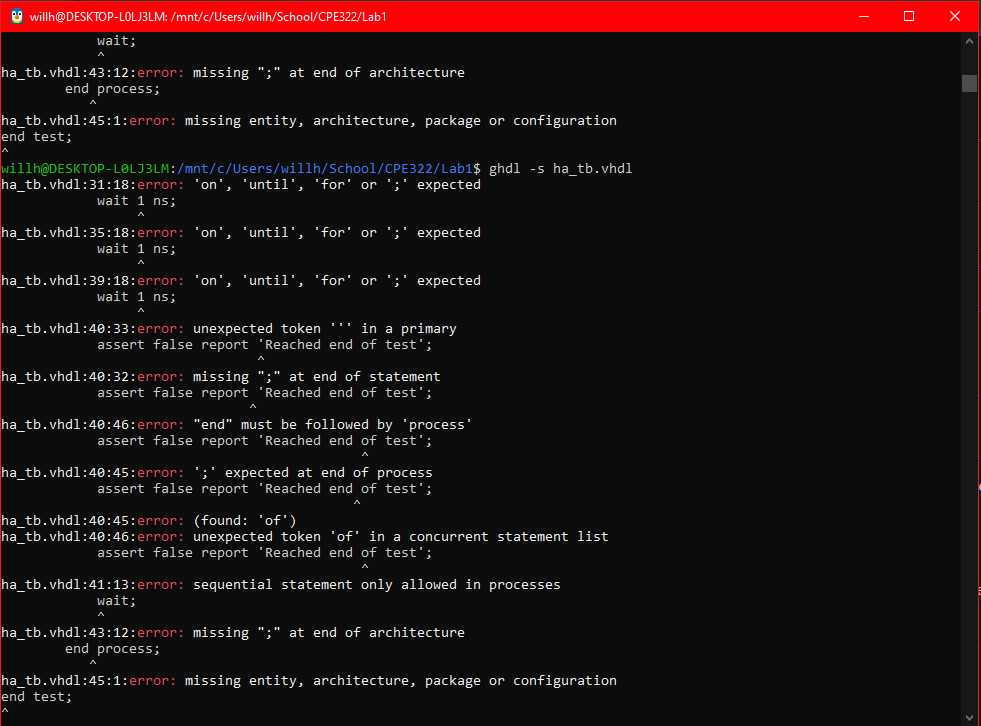
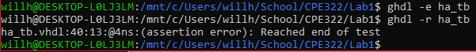
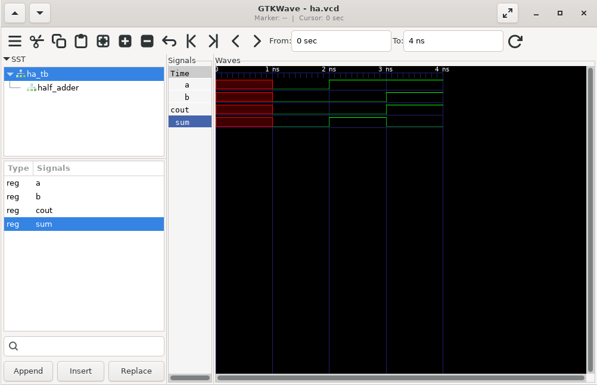
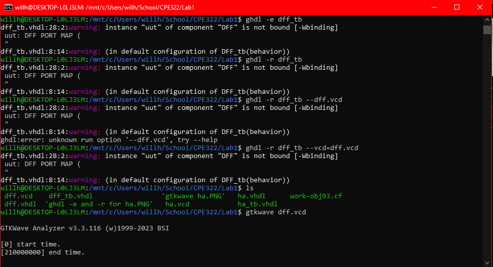
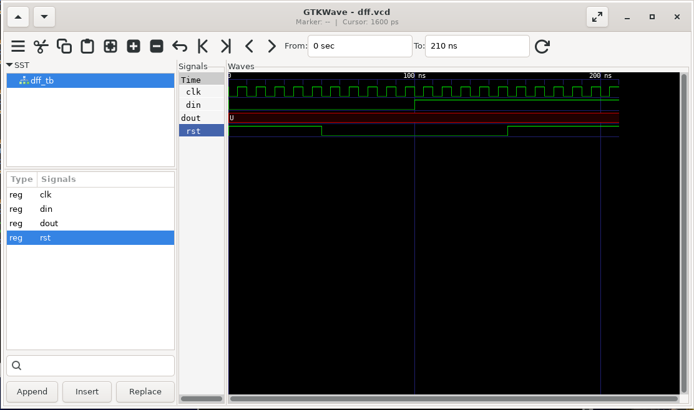

# Summary of Lab 1
## Installing GHDL and GTKWave
In order to use the programs needed to complete this lab, I decided to install and use WSL (Windows Subsystem for Linux) using the following Windows Shell command:

` wsl --install `

After restarting my computer to allow Ubuntu to install and setting up my default Linux user, I ran the following commands to update my apt package manger and install both ghdl and gtkwave

``` 
sudo apt update
sudo apt install ghdl
sudo apt install gtkwave 
```



## Writing and Testing Basic Half Adder VHDL files with GHDL
In order to try using ghdl and gtkwave, I installed vscode for WSL and created a basic VHDL file for a half-adder and a testbench for said half-adder. 
I learned that the following commands can be run in the Linux terminal to make use of ghdl's analysis and syntax checking tools.

```
ghdl -s ha_tb.vhdl  // -s tells ghdl to check the syntax of the specified VHDL code file
ghdl -a ha.vhdl     // -a tells it to analyze the file for logical errors
```

Once I checked the syntax and logic of my half adder files, I evaluated and ran the testbench using the following commands;

```
ghdl -e ha_tb  
ghdl -r ha_tb
```

This is the result in my terminal



To view the results of running the testbench, we create a .vcd file using the same 'run' command from above, and add the argument `--vcd=ha.vcd`. 
This allows us to use gtkwave to see the changes in our component's outputs as we modify the inputs in the testbench file.



I then followed the same process for the D-flip-flop VDHL files, which I downloaded from the dsd repository


