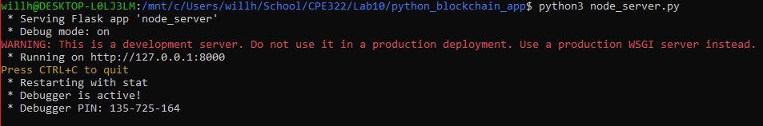
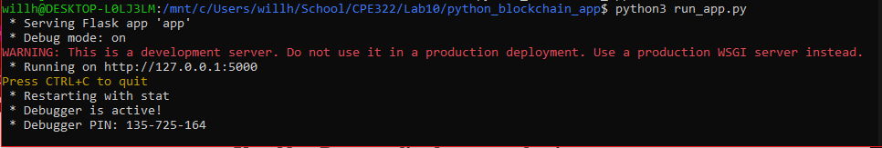
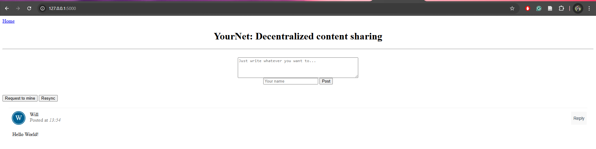
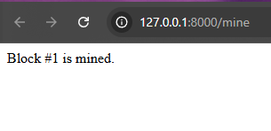

I chose to do this lab on WSL, as with previous labs   
I started by installing Flask using pip:   

```pip3 install flask --break-system-packages```
I ran the hash_value script 2 times and got 2 different hash values each time:   


I then ran the snakecoin.py script and the snakecoin server.   


After running the server, I setup another terminal and ran the command from the github to mine a block of snakecoin   


## Node Server
To beign running the server, I started by cloning the python blockchain app in the README file of the lab. ```git clone https://github.com/satwikkansal/python_blockchain_app.git```
I then used nano to uncomment the last line of the script ```nano node_server.py```
Finally, I ran the server on port 8000, as the last line of the node_server code indicates ```python3 node_server.py```  
I then opened a second terminal, navigated to the python app directory, and ran the app ```python3 run_app.py```

To use the server and app, I opened two browser tabs to the following local addresses:  
[YourNet](http://127.0.0.1:5000/),  [Mine](http://127.0.0.1:8000/mine)

This is what the final products looked like:  




