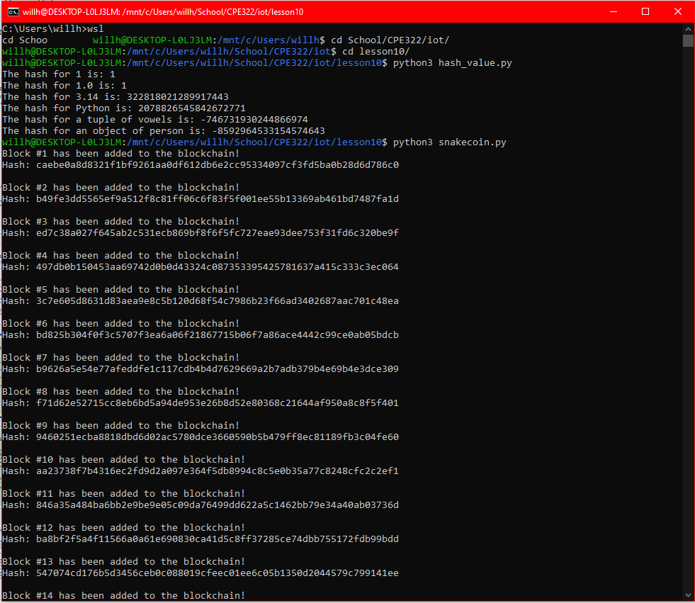
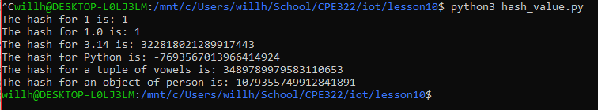
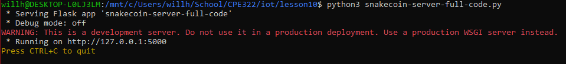
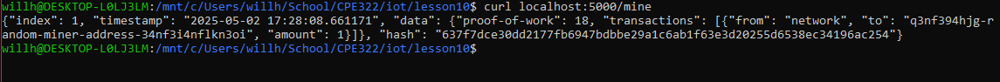

I chose to do this lab on WSL, as with previous labs   
I started by installing Flask using pip:   

```pip3 install flask --break-system-packages```
I ran the hash_value script 2 times and got 2 different hash values each time:   



I then ran the snakecoin.py script and the snakecoin server.   


After running the server, I setup another terminal and ran the command from the github to mine a block of snakecoin   

