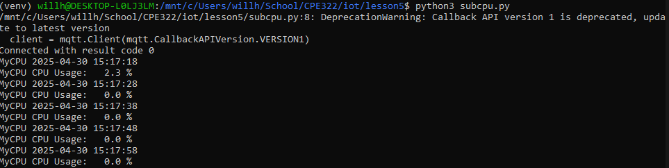

I began this lab by cloining the iot repository lcoally, then cd'ing into the lesson 5 folder
In order to install the necessary packages for paho-mqtt, I created a virtual environment using the following commands:
```
python3 -m venv --system-site-packages venv
source venv/bin/activate
```

I then installed paho-mqtt and other necessary packages with the following commands:

```
pip install paho-mqtt --upgrade
pip install psutil
```
In my inital attempts for this lab, I encountered several issues with installing the most up-to-date versions of paho-mqtt   
and psutil, which necessitatest the --upgrade flag and the extra installation of psutil

After doing this, I was finally able to run both subcpu.py and pubcpu.py in separate terminals, resulting in the following messages about my cpu usage:  


