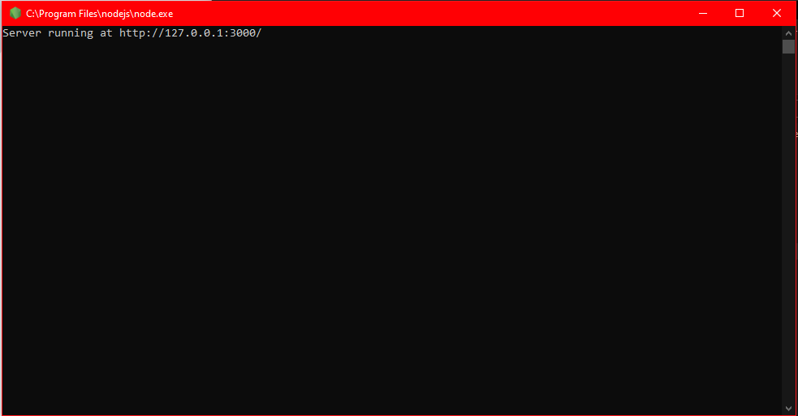
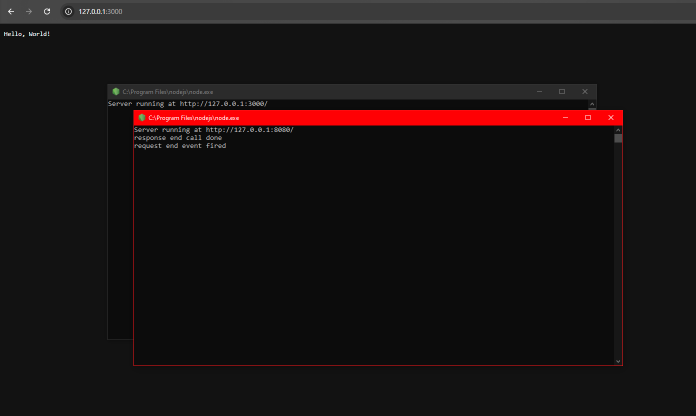

I chose to do this lab with my Windows Desktop rather than using WSL  
I went top the following link: [Nodejs](https://nodejs.org/en) to download the installer for Windows

After running the installer, I opened the iot repository, which I had cloned from a previous lab  
Once I ran each of the scripts, I got a command prompt window indicating the successful launch of the server

When I opened the IP addresses indicated in the command window in my browser, I got a screen that looked like the following:  

