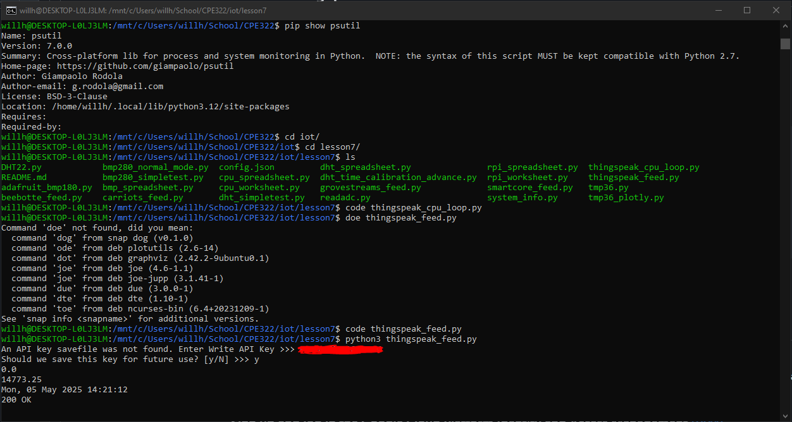
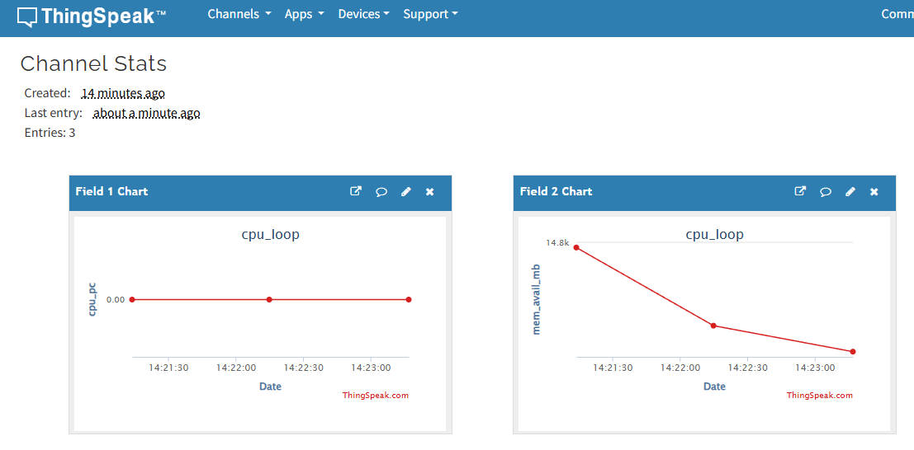

## Thingspeak
I began this lab by signing up for ThingSpeak and linking my account to my pre-existing MATLAB account  
Once I created the channel and set up the feeds as instructed, I copied my API Key.  

I already has psutil installed from a previous lab, so I used ```pip show psutil``` to ensure I had it installed properly  
I then used vscode to insert my API key into both the python scripts that run the lab  
```
code thingspeak_cpu_loop.py
code thingspeak_feed.py
```
Finally, I ran the app, and the screenshots below show the results in both my terminal and in Thingspeak a few minutes later  



## Google Sheets
